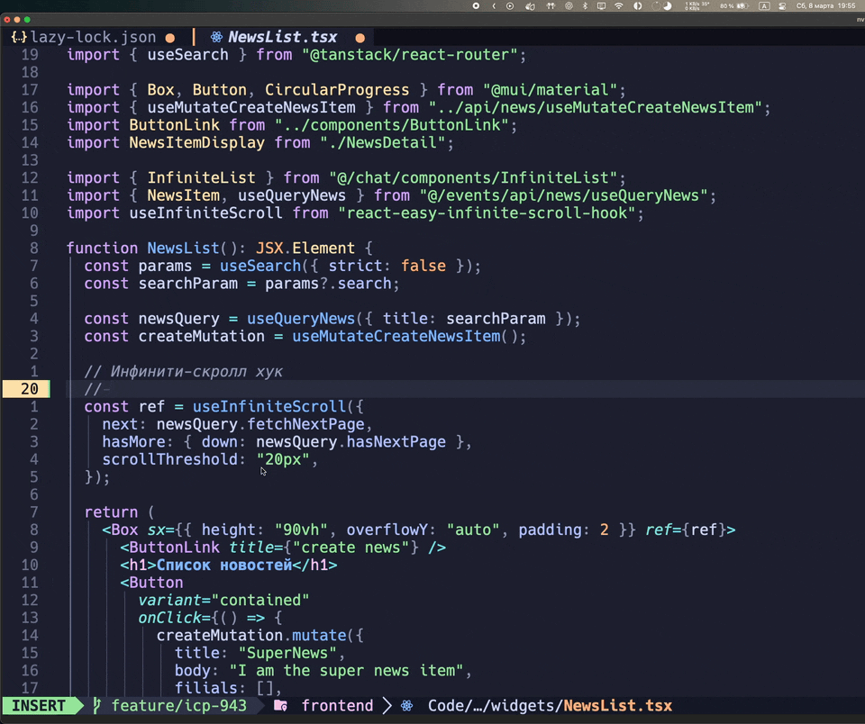
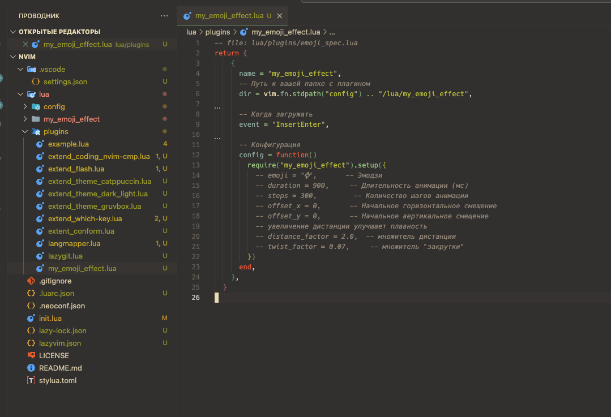

# Description

Plugin for LazyVim (neovim) which add animation while typing

! This was written for fan so can contain some bugs

# Demo

# Setup

Assume to copy `my_emoji_effect` packege to `/Users/some_user/.config/nvim/lua` and add this plugin by `my_emoji_effect.lua` like in screenshot

# Config

Currient emoji set in `./my_emoji_effect/config.lua`